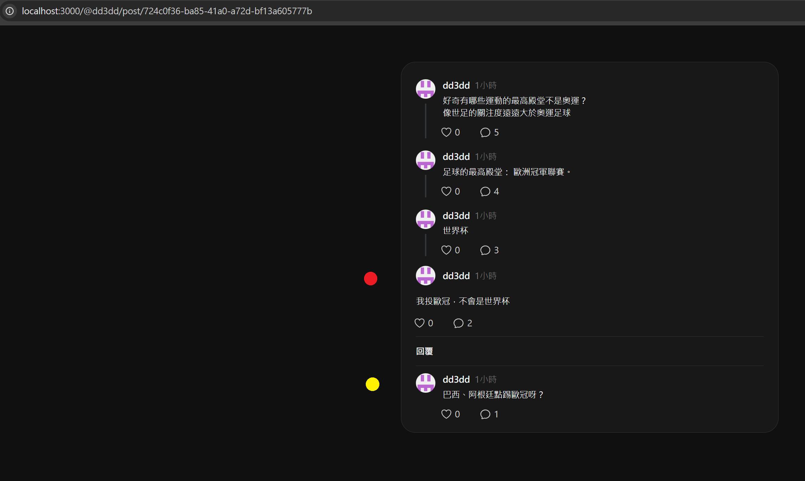
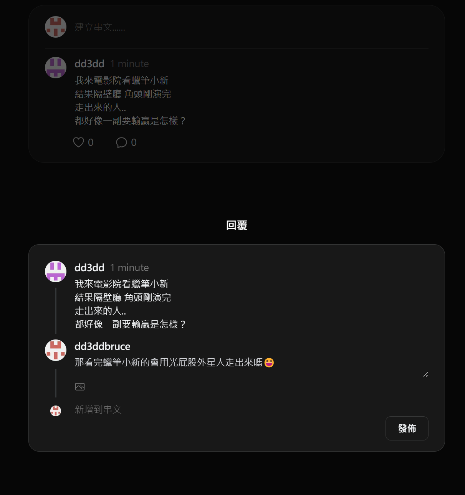
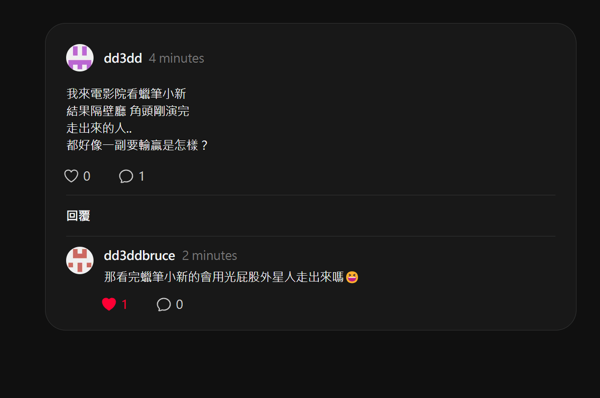
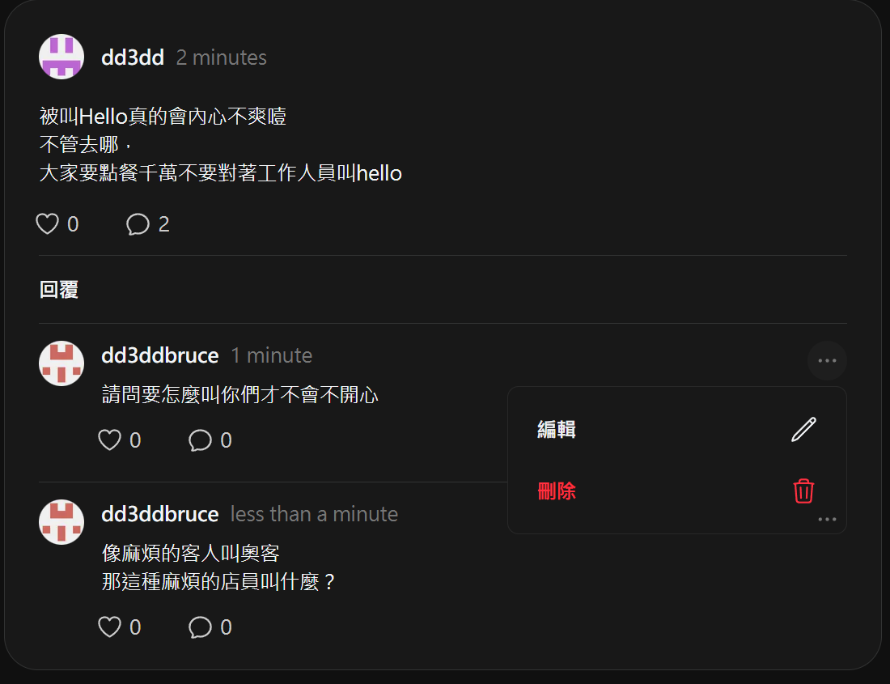
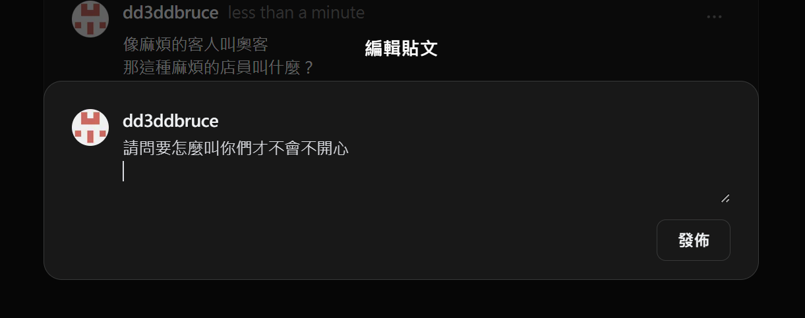

# threads-clone

盡可能實現 threads 網頁版的功能及外觀，練習前後端開發技能

### Language & Framework & Library & Tool

TypeScript, Next.js, Tailwind CSS, NextAuth.js, Prisma, Supabase

### 目前功能

#### 登入

(Instagram API 似乎無法用於驗證，因此改用 GitHub)

若是初次登入的使用者，會在 Supabase 新增該使用者的資料

#### 建立貼文

登入後可以建立貼文，其中點擊「新增到串文」，會多出一個 textarea，如果一次發佈多個貼文，貼文的 parentId 會設為上一篇貼文(如果沒有 parent 就是 null)

#### 瀏覽貼文

threads 有許多顯示貼文的方式(為您推薦、追蹤中、已說讚、已儲存)

目前在首頁直接顯示所有貼文，其中回覆的數量包含「直接」回覆和「間接」回覆，也就是上圖的第二及第三貼文，都算是第一篇文的回覆

特定貼文的顯示方式:

(下圖為 threads 隨機複製一篇串文的內容)

當點擊任意一篇貼文，會顯示他的 parent 並遞迴查詢，直到 parent_id 為 null，也就是首頁的貼文。

以圖片舉例，紅點表示目前的貼文，回覆「世界杯」這則貼文，「世界杯」則回覆「足球的最高殿堂......」這則貼文，

黃點則代表對紅點這篇貼文的「直接」回覆 (也可能有多筆)

回覆特定貼文:

點擊留言的 Icon，即可針對特定貼文留言(也就是把 parent_id 設為該貼文)。

按愛心 & 貼文時間

同一個 user 只能對同一篇貼文按一次愛心(新增這筆 Like 紀錄)，再按一次則取消(刪除這筆 Like 紀錄)

貼文時間使用 date-fns 這個 library 方便處理 post 的建立時間到現在的時間差

編輯貼文 & 刪除貼文

對自己的貼文編輯或刪除，刪除會同時刪除所有子貼文

### 待完成

持續改進現有程式碼
